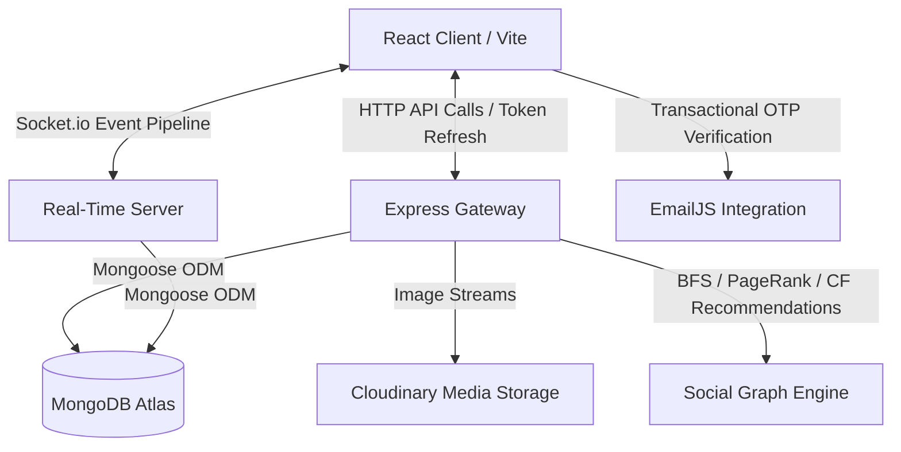

# 🍀 Lucky Cart — Enterprise MERN Social E-commerce Platform

[](https://mongodb.com)
[](https://socket.io)
[]()
[](https://cloudinary.com)
[-ff69b4.svg)](https://vitejs.dev)

Welcome to **Lucky Cart**, a highly sophisticated, production-ready, and mobile-responsive social e-commerce marketplace built using the **MERN stack** (MongoDB, Express, React, Node.js). 

Unlike standard online shopping applications, Lucky Cart merges commercial transactions with a **social graph network**. It leverages graph-theory algorithms (like PageRank and BFS pathfinding) to power peer-to-peer recommendations, real-time collaboration, and network influence leaderboards. It features robust panels for Consumers, Sellers, and Superadministrators.

---

## 🌟 Architecture & Core Engines



### 1. The Social Graph Engine
At the heart of Lucky Cart is a graph database layer modeled on top of MongoDB using custom algorithms:
*   **BFS Connection Pathfinder**: Traces relationships (follows) across the user graph to find and visualize the shortest degree of separation between any two platform users (Six Degrees of Separation).
*   **Power-Iteration PageRank**: An iterative algorithm that periodically evaluates the follow topology to compute an "Influence Score" (0–100) for every user, establishing a real-time platform influencer leaderboard.
*   **Collaborative Filtering Network Recommendations**: Analyzes product interactions (`purchased`, `shared`, `wishlisted`, `liked`, `viewed`) within a user's 1st and 2nd-degree connections to generate personalized product recommendations using weighted scoring.
*   **Hybrid Group Recommendations**: Suggests shopping groups based on a mathematical combination of mutual followed members (5 pts) and overlaps in categories of interest (3 pts).

### 2. Real-Time Socket.io Pipeline
Fully decoupled event-driven communication layer supporting:
*   **1-to-1 Direct Messaging** and **Multi-user Shopping Groups**.
*   **Live User Typing Indicators** and **Online/Offline Status Trackers**.
*   **Real-time Message Reactions** (custom emojis) with instant UI state synchronization.
*   **Read Receipts** updating message states once viewed by the active recipient.
*   **Metadata Attachments**: Sharing shopping carts, wishlists, or individual products directly in chat, which recipients can clone in a single click.

---

## 🛠️ Feature Catalog

### 🛒 1. Consumer (Buyer) Experience
*   **Glassmorphism Marketplace**: High-performance, paginated shopping feed featuring fuzzy keyword search, category filtering, dynamic price strikes, and responsive grid cards.
*   **Email OTP Verification System**: Prevents spam registrations by validating customer email authenticity via temporary One-Time Passcodes powered by EmailJS during registration.
*   **Secure JWT Session Hardening**: Access and refresh tokens with silent token refreshing on `TOKEN_EXPIRED` 401 triggers, backed by a frontend promise subscriber queue to handle concurrent API race conditions.
*   **Verified Buyer Reviews**: Star rating and comment system restricted exclusively to users with a database-verified purchase of that specific item.
*   **Address & Budget Management**: Profiles with multiple address books, loyalty points counters, and interactive monthly spending dashboards.
*   **Account Privacy Toggle**: Users can switch between Public and Private profiles. If private, incoming follow requests require manual approval, and wishlists/activity streams are locked.
*   **Wishlist Cloning**: One-click utility that lets a user clone a followed friend's entire public wishlist directly into their profile.

### 🏪 2. Seller Control Center
*   **Interactive Listings Dashboard**: Manage active listings with dynamic search, pagination, and stock indicators.
*   **Cloudinary-Backed Media Creator**: Listing creation with on-the-fly image optimization and uploads directly to Cloudinary.
*   **Price-Drop Notification Dispatcher**: When a seller reduces a listing's price below its historical average, the system tags the item with a discount badge and dispatches automated in-app alerts to all customers who previously viewed that product.
*   **Intelligent Bulk CSV Ingestion**: Sellers can upload hundreds of products at once. The ingestion pipeline:
    *   Finds headers dynamically anywhere in the CSV (skips garbage rows).
    *   Resolves variations using synonyms (e.g. `qty`, `inventory`, `count` all map to `stock`).
    *   Validates data schemas inline (rejects invalid prices/stock formats).
    *   Checks database duplicates (unique names and barcodes) before writing.
    *   Logs row-by-row errors to let the seller fix failed lines.

### 🛡️ 3. Superadmin Console
*   **Interactive Social Circle Simulator**: HTML5 Canvas force-directed physics simulation of the user relationship network. Admins can:
    *   Drag and pin nodes.
    *   Recalculate PageRank and Closeness Centrality dynamically.
    *   Run pathfinders visually (highlighting paths in neon green).
    *   Add follow/chat edges to see the graph adapt.
*   **Business Intelligence (BI) Dashboard**: Built-in Chart.js graphing showing monthly revenue lines, payment distribution breakdown (UPI, Card, COD), and order status doughnuts.
*   **System Overrides**: Moderation panel to approve/reject reviews, modify order delivery statuses, update stock levels, and delete products platform-wide.
*   **Database Management Utilities**: Clear platform data, trigger system-wide graph updates, and download complete database CSV dumps.

---

## 🚀 Installation & Setup

### Prerequisites
*   [Node.js](https://nodejs.org/en/) (v16 or higher)
*   [MongoDB Atlas](https://www.mongodb.com/cloud/atlas) or a local MongoDB database instance
*   [Cloudinary Account](https://cloudinary.com/) (for listing image uploads)
*   [EmailJS Account](https://www.emailjs.com/) (for customer OTP emails)

---

### Step-by-Step Installation

#### 1. Clone the Repository
```bash
git clone https://github.com/yourusername/lucky_cart.git
cd lucky_cart
```

#### 2. Backend Setup & Config
1.  Navigate to the backend directory:
    ```bash
    cd backend
    ```
2.  Install packages:
    ```bash
    npm install
    ```
3.  Configure variables. Create a `.env` file in the `backend/` root directory:
    ```env
    PORT=5000
    NODE_ENV=development
    MONGO_URI=mongodb+srv://<username>:<password>@cluster0.mongodb.net/lucky_cart
    JWT_SECRET=your_jwt_access_secret_key
    JWT_REFRESH_SECRET=your_jwt_refresh_secret_key
    CLOUDINARY_CLOUD_NAME=your_cloudinary_cloud_name
    CLOUDINARY_API_KEY=your_cloudinary_api_key
    CLOUDINARY_API_SECRET=your_cloudinary_api_secret
    ```
4.  Start backend server:
    ```bash
    npm run dev
    ```

#### 3. Frontend Setup & Config
1.  Open a new terminal and navigate to the frontend directory:
    ```bash
    cd ../frontend
    ```
2.  Install packages:
    ```bash
    npm install
    ```
3.  Configure credentials. 
    *   Ensure that `src/utils/api.js` points to `http://localhost:5000/api` (handled automatically via the Vite config proxy in development).
    *   Update EmailJS credentials in `src/pages/Register.jsx` to enable live OTP flows.
4.  Start development server:
    ```bash
    npm run dev
    ```
5.  Access the platform in your browser at `http://localhost:5173`.

---

## 🛠️ Complete Tech Stack

*   **Frontend**: React (Vite), React Router v6, Tailwind CSS, Lucide Icons, Chart.js, HTML5 Canvas API
*   **Backend**: Node.js, Express.js, Socket.io
*   **Database**: MongoDB, Mongoose ODM
*   **Storage**: Cloudinary API
*   **Security**: JSON Web Tokens (JWT) with secure storage, bcryptjs, HTTP Auth Interceptors
*   **Integrations**: EmailJS (SMTP/OTP client-side delivery)

---

*Engineered with ❤️ to showcase the convergence of commercial platforms and graph theory.*
